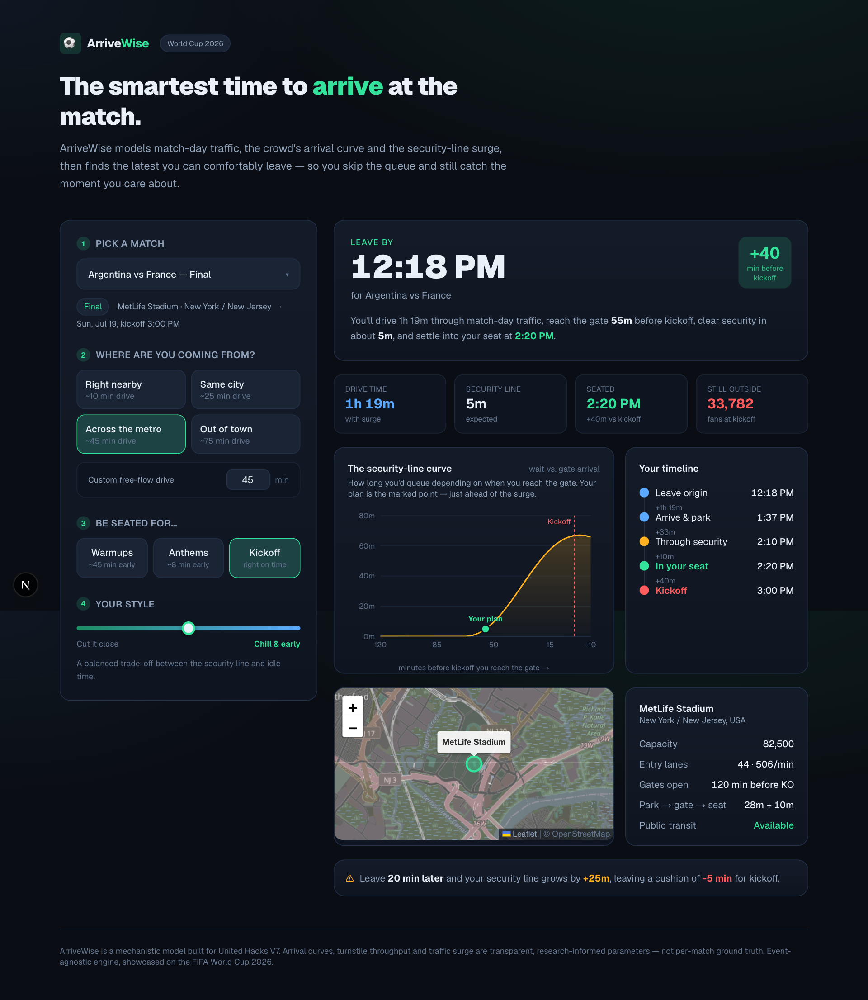

# ⚽ ArriveWise

**The smartest time to arrive at the match.** ArriveWise tells a fan exactly when
to leave home for a big event so they arrive as *late as comfortably possible* —
skipping the security-line surge while still catching the moment they care about.

Built for **United Hacks V7** (sport theme). Showcased on the **FIFA World Cup
2026** and its 16 host stadiums, but the engine is event-agnostic.



---

## The problem

Everyone over-arrives at stadiums "to be safe," burning an hour in their seat — or
under-arrives and misses kickoff stuck in a security line. The genuinely hard part
is that the *best* arrival time isn't a fixed rule: it depends on match-day
traffic, how the crowd bunches up before kickoff, and how fast the gates process
people. ArriveWise models all three and computes the answer.

## Why there's no "historical arrival dataset" (and why that's fine)

Per-fan *"arrived at T, waited W minutes"* logs are not published anywhere, so we
**don't fake one**. Instead ArriveWise is a **mechanistic model** — a small piece
of transportation/queueing engineering whose parameters come from real, citable
sources. Every number is a transparent, tunable input, not a black box.

## How the model works

Everything is computed on a time axis **τ = minutes relative to kickoff** (negative
= before). See `src/lib/engine/`.

1. **Crowd arrival curve** (`queue.ts`, `curves.ts`) — spectators reach the gates
   on a distribution that builds through the pre-match window and peaks ~30 min
   before kickoff. Modeled as a truncated normal, scaled to expected attendance
   (capacity × a round-dependent turnout fraction).
2. **Security queue** (`queue.ts`) — a **deterministic fluid queue**. Each minute,
   `queue = max(0, queue + arrivals − gate_capacity)`, where gate capacity =
   `entry_lanes × per-lane throughput` (~11–12 people/lane/min, a standard
   sports-ingress figure). This yields the expected wait for a fan reaching the
   gate at *any* minute — the core "security-line curve" you see in the app.
3. **Traffic & conditions** (`travel.ts`, `curves.ts`) — the experienced drive is
   free-flow time × three composable multipliers: a **match-day surge** (grows
   toward kickoff, scales with match importance), an **ambient baseline** (a
   time-of-day commute curve by default, or a live/predicted traffic ratio when a
   routing key is set), and a **weather** factor — plus parking-search and walk
   times. Car is the baseline mode; the plan shows the full `× surge × baseline ×
   weather` breakdown so nothing is hidden.
4. **Optimizer** (`cost.ts`, `optimizer.ts`) — sweeps every candidate gate-arrival
   minute and minimizes a cost:
   `security_wait + early_penalty·earliness + late_penalty·lateness + hard_penalty·missed_kickoff`.
   The **"chill ↔ cut-it-close" slider** reshapes these weights (a chill fan hates
   being late and tolerates arriving early; a cut-it-close fan does the reverse).
   The winning arrival time is back-solved into a **"leave home by" clock time**.

The result: a recommended departure time, a full timeline, the security-line
curve with your plan marked, a sensitivity readout ("leave 20 min later → +X min
in line"), and venue context.

## Onboarding & live data (algorithm at the core, data at the perimeter)

You reach the plan through a short **onboarding wizard** — pick a match, share
*where you're starting from* (one-tap **live location**, an address, or a rough
distance), choose the moment you can't miss, how you're travelling, and your
style — then the dashboard reveals your plan.

Real inputs enter only at the **perimeter**, via Next.js API routes, and every
one degrades gracefully so the demo never depends on a key or the network:

- **Location → real route** — the browser Geolocation API (or an address geocoded
  through **OSM Nominatim**, keyless) gives real coordinates; `/api/route`
  computes drive time via **TomTom** (real *live/predicted* traffic, if a key is
  set) → **OSRM** (real route, free-flow) → a straight-line estimate.
- **Weather** — `/api/weather` reads the live venue forecast from **Open-Meteo**
  (keyless) for the match date/hour, with a manual weather selector as fallback.

The recommendation engine itself stays **pure and deterministic**: it consumes a
small, fully-resolved conditions object and never fetches.

## Tech

- **Next.js 16 (App Router) + TypeScript + Tailwind v4** — deployed serverless.
- **Recharts** for the wait-vs-arrival curve, **Leaflet + OpenStreetMap** for the
  venue map (keyless).
- The engine is **pure client-side TypeScript**; live data comes through thin
  server **route handlers** (`src/app/api/*`). **No paid dependency is required** —
  Nominatim, OSRM and Open-Meteo are keyless; the only optional key (`TOMTOM_KEY`)
  unlocks live/predicted traffic and is never exposed to the browser. Static data
  lives in `src/lib/data/`.

## Run it

```bash
npm install
npm run dev        # http://localhost:3000
```

Runs fully out of the box. To enable live/predicted traffic, copy `.env.example`
to `.env.local` and set `TOMTOM_KEY` (free tier — optional; without it routing
uses the keyless OSRM fallback).

Checks:

```bash
npm run sanity     # engine assertions (arrival, queue, traffic, weather, optimizer)
npm run typecheck
npm run lint
npm run build
```

## Deploy (free)

Push to GitHub, then import the repo at [vercel.com/new](https://vercel.com/new).
Vercel auto-detects Next.js — no configuration required. To turn on live traffic,
add `TOMTOM_KEY` in the project's environment variables (optional). Every push
redeploys. (Cloudflare Pages / Netlify work identically.)

## Project layout

```
src/
  app/
    page.tsx           onboarding ↔ dashboard orchestrator
    api/               route handlers: geocode · route · weather (with fallbacks)
  components/
    onboarding/        the 5-step wizard + steps
    ResultPanel, Timeline, WaitChart, MatchMap
  lib/
    engine/            the model: curves · queue · travel · cost · optimizer
    data/              16 stadiums, sample matches, origin presets
scripts/sanity.ts      engine assertions
```

## Honesty note

Arrival curves, turnstile throughput, traffic-surge and time-of-day shapes are
**research-informed parameters**, not per-match ground truth. Live weather
(Open-Meteo) and, with a key, live/predicted traffic (TomTom) are real; routing
without a key is a real route with no live traffic, and the offline estimate is
distance-based. Roof types and travel-mode effects are transparent, tunable
inputs. The honest path for per-fan calibration is a crowdsourced feedback loop
(fans reporting actual waits) — a designed-in next step, not part of this build.
